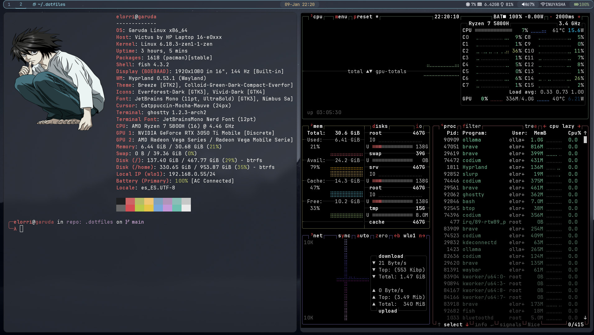
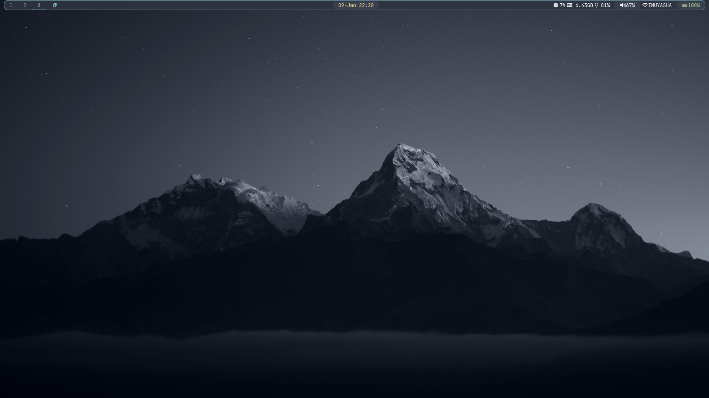
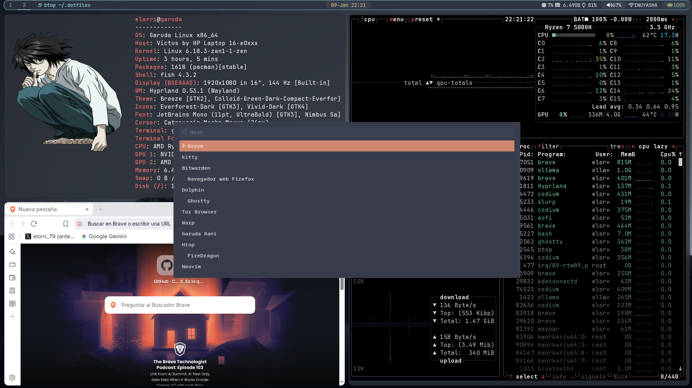

# ❄️ Elorri's Dotfiles | Garuda Hyprland

A personalized, minimal, and dark-themed Hyprland configuration. Built for efficiency and a clean aesthetic.

---

## 🖥️ System Overview
- **OS**: Garuda Linux (Arch-based)
- **WM**: Hyprland
- **Bar**: Waybar (Customized for `wlo1` interface)
- **Terminal**: Ghostty
- **File Manager**: Yazi / Thunar

## ✨ Key Features
- **Dynamic Waybar**: Monitor CPU, RAM, and Battery at a glance.
- **Network TUI**: Integrated `nmtui` directly from the status bar.
- **Window Tracking**: Active window title displayed in the center.

## ⚙️ How it's managed (GNU Stow)

This repository uses **GNU Stow** to manage symlinks. Instead of manually copying files to `~/.config`, Stow creates "mirrors" of these folders into your home directory.

- **How to use it**: 
  ```bash
  cd ~/.dotfiles
  stow . # This links everything to your home directory

## 📸 Preview

<p align="center">
  
</p>
<p align="center">
  
</p>
<p align="center">
  
</p>

## 🤝 Credits
- Base configuration and logic inspired by kikefdezl's dotfiles.
- Built on [Garuda Linux](https://garudalinux.org/).
- Icons powered by [Nerd Fonts](https://www.nerdfonts.com/).
- **AI Assistant**: Developed and refined with the help of **Google Gemini**, who assisted in troubleshooting the Waybar network modules, Git configuration, and README documentation.

---
*Maintained by Elorri79*